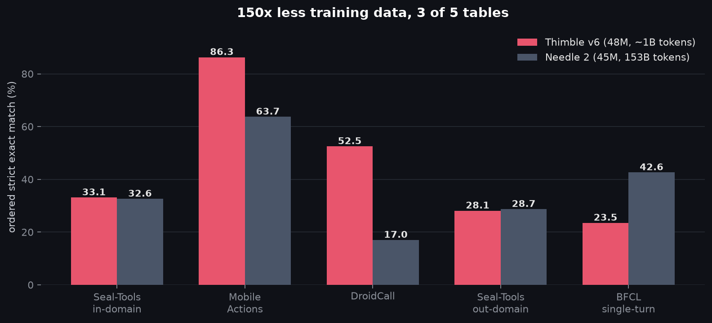

# 🧵 Thimble

**A tool-calling layer, not a language model.** Your schemas in, validated calls
out, at 48M parameters.

It does not converse, reason, or write prose — it was never trained to. It reads
a catalog of typed functions and a request, and returns the calls to make or an
empty list when nothing fits.

That narrowness is the design, not a limitation of it. The tokenizer, the
training loss, and the decoder are all built around the same five decisions, so
the model is never asked to spend capacity on JSON it will never emit. The whole
job then fits in 48M parameters — small enough that specializing it to one API
surface is routine rather than a project.

[**GitHub — code, adaptation loop, full experimental record**](https://github.com/nikshepsvn/thimble) · MIT · 48.12M params · 768-token context



## The contract

Three guarantees hold on **any** catalog, with no training and no configuration,
because they come from a grammar compiled out of your schemas rather than from
the weights:

- **Output is always well-formed JSON.** Malformed output is unreachable, not unlikely.
- **Argument keys come from your schema.** Parameter-name hallucination is structurally impossible.
- **Calls to tools you did not declare cannot be emitted.**

The model is consulted at exactly five choice points: refuse-or-call, which tool,
include this optional, what value, stop or continue. Everything else — braces,
quotes, commas, every argument key — is determined before it runs. Accuracy is a
separate question, answered below with numbers; the contract is not conditional
on any of them.

## Does this fit your problem?

**Works out of the box when** requests are command-shaped and state their values:
`annotate variant rs4988235 against build GRCh38`. Identifiers, codes, dates,
numbers, enum picks — copied, not inferred. Chains are fine: two-plus-call rows
score **73.5%** on a catalog it knows.

The gate is how *extractive* the request is, not what domain it belongs to. In a
pair of small probes, an unseen biomedical catalog in `dot.notation` scored 0.75
while a familiar-looking app catalog with conversational phrasing scored 0.57.
(15 rows total — directional, not a measurement.)

**Adapt it when** you need conversational phrasing, disciplined handling of
optional arguments, or calibrated refusal — the three documented weak spots.

**Use something else when** you have an open-world catalog, need Java or
JavaScript schema dialects, or need parallel instantiations of one schema. If you
can afford 600M parameters, fine-tune Qwen instead — it will probably score
higher. This is for when you cannot.

## Numbers

Ordered strict exact match — function names, call order, and every argument value
must match. The right-hand column is a yardstick, not a rival: Needle 2 (Cactus
Compute, 45M params, 153B training tokens), their published numbers on their
metric, so the left column has a scale.

**Catalog represented in training** (eval rows firewalled out):

| suite | Thimble v6 | Needle 2 (45M) |
|---|---:|---:|
| Mobile Actions (961) | **86.3** | 63.7 |
| Mobile Actions, two-plus-call rows | **73.5** | 48.4 |
| DroidCall (200) | **52.5** | 17.0 |
| Seal-Tools in-domain (700) | **33.1** | 32.6 |
| Well-formed JSON | **100.0** | 93.4 |

**Catalog never seen:**

| suite | Thimble v6 | Needle 2 (45M) |
|---|---:|---:|
| Seal-Tools out-of-domain (654) | 28.1 | 28.7 |
| BFCL v4 single-turn (3,641) | 23.5 | 42.6 |

The spread is visible *inside a single suite*: Seal-Tools in-domain 33.1 against
out-of-domain 28.1, same model, same metric, only the catalogs changed.
Name-sequence accuracy tracks it exactly, 88% against 79%.

**Disclosures.** Mobile Actions' public train split (8,693 rows, disjoint from
eval) is in the training mix — that is what the first table's heading means. The
Seal-in margin over the yardstick is +0.5 on 700 rows, within sampling noise. The
pre-registered selector picked a sibling checkpoint that scored worse; the
failure is diagnosed with both models' tables published in
[FINDINGS.md](https://github.com/nikshepsvn/thimble/blob/master/FINDINGS.md).

## Adapting it to your catalog

```bash
git clone https://github.com/nikshepsvn/thimble && cd thimble
uv venv && uv pip install -e ".[hub]"

# both files come from this repo; neither is in git
hf download flashvenom/thimble thimble-v6.pt --local-dir checkpoints/
hf download flashvenom/thimble tokenizer.json --local-dir data/

# where do you stand on your own tools?
python scripts/eval_catalog.py --ckpt thimble-v6 \
    --catalog my_tools.json --gold my_eval.jsonl

# synthesize against your schemas, anneal into the decay phase
python scripts/adapt.py --catalog my_tools.json --name mydomain

# did it help?
python scripts/eval_catalog.py --ckpt mydomain --baseline thimble-v6 \
    --catalog my_tools.json --gold my_eval.jsonl
```

Two things about that recipe are load-bearing, both measured rather than assumed.
**Anneal, don't retrain** — the same corrective corpus scored 28.4 fed from
scratch and 33.1 annealed into the LR-decay phase. **Keep the guard data** —
annealing purely on your catalog trades away the competence you are building on.

Needs `OPENROUTER_API_KEY` for synthesis and a GPU to train. For scale, the v6
cycle synthesized 74,250 validated rows for $56.

`adapt.py` wires together exactly the machinery that produced the v6 result, but
no third-party catalog has been adapted and published yet. The recipe is
measured; the ergonomics are new.

## How it works

Most constrained-decoding systems bolt a grammar onto a model trained to generate
free text, then manage the mismatch. Here the **tokenizer, the training loss, and
the decoder are one design**, built around the same five decision points:
refuse-or-call, which tool, include this optional, what value, stop or continue.

**The tokenizer is built for the grammar.** JSON structural characters — and
digits — are singleton tokens. Structure can therefore be force-fed *exactly*,
with no token-healing and no ambiguity about where a constraint lands. The usual
arrangement masks logits over a vocabulary that merged `",` into a single token
and papers over the seam. Digits never merge either, so a copied number tokenizes
the same way every time; the rebuild was verified by a fragmentation gate
(word-value fragmentation 2.72 → 2.34 tokens/word, digits lengthening by design).
It shipped as part of the v4 → v5 bundle that took name-sequence accuracy from
80.4% to 91.5% — that bundle also added 350k corpus rows and reweighted the mix,
so the tokenizer's own share of the gain was never isolated.

**The loss is weighted by those same five decisions** — structure 1x, keys 1.5x,
names 2x, values 4x, stop-decision 6x — matched to the measured error
distribution. The model is optimized for the choices it will be asked to make,
not for tokens it will never emit.

**The decoder consults the model only at those points.** Everything else is
determined before it runs, which is where the contract above comes
from. One call, start to finish — `MODEL` marks the only places the network is
asked anything:

```
  [                                    <- grammar
  └─ ? refuse or call ...................... MODEL
       │
       ├─ refuse ──────────────► ]      <- grammar
       │
       └─ call
          {"name":"                     <- grammar
          └─ ? which tool .................. MODEL
             ","arguments":{            <- grammar
             │
             ├─ next key from YOUR schema  <- grammar
             │  ├─ ? include it ........... MODEL
             │  └─ ? what value ........... MODEL
             │     (repeat for each key)
             │
             }}                         <- grammar
             └─ ? stop or continue ........ MODEL
                ├─ continue ──► back to {"name":"
                └─ stop ──────► ]        <- grammar
```

Every `<- grammar` line is emitted without consulting the model at all. Argument
keys are iterated from your schema, which is why inventing one is not a
low-probability event — there is no step at which it could happen.

### Evidence the co-design works

Two measurements that look like caveats in isolation are the proof in context.

**There is no projection tax.** The same rows decoded with the grammar and with
no grammar at all (`scripts/draft_vs_constrained.py`):

| suite | free generation | grammar-constrained |
|---|---|---|
| Mobile Actions (150) | 78.7 | 78.7 |
| Seal-Tools in (150) | 26.7 | 28.0 |

On Mobile Actions the two agree on **150 of 150 rows**. The grammar is not
overriding the model — the model already wants what the grammar enforces. A
bolted-on grammar produces disagreement and a tax to recover; this is why
draft-then-constrain (DCCD) had nothing to recover here and was abandoned.

Stated plainly, because the distinction matters: the grammar buys *reliability*,
not accuracy. "Constrained decoding makes the model correct" would be a different
claim and not one this data supports. What it buys is that the worst failure
modes cannot be expressed, plus parseability on the ~11% of Seal rows where free
generation emits invalid JSON.

**And the co-design is load-bearing, not decorative.** Down-weighting the
grammar-forced tokens in the loss — on the theory that the model need not learn
what the decoder will supply — cost **12 points** in a controlled twin run. Those
tokens carry the call-sequencing signal: the model learns *when a call ends*
through structure it never has to emit. Remove them and it breaks.

### The rest of the stack

- **Retriever** — `retrieve(query, tools, emitted=...)`, a DTDR-style
  (arXiv 2512.17052) refresh conditioned on the *partial plan*, so the candidate
  set is recomputed after each emitted call rather than once per request.
- **Name head** — a bilinear readout scoring candidate tool-name spans in the
  prompt against the hidden state at the decision position. Selection is treated
  as pointing at the prompt, not generating from a vocabulary, following "Looking
  Is Not Picking" (arXiv 2606.16364): mis-selection is a readout failure, not a
  perception one. Its only positive result was on *unfamiliar* catalogs (+2.2),
  which is why it is on by default for your own tools.
- **Trunk** — deep-thin and gated: d=448, 20 layers, GQA 8/4, SwiGLU x2.0,
  QK-norm, sandwich RMSNorm, tied embeddings, Muon on 2D weights and AdamW on
  embeddings, norms and heads. This part is standard modern practice and is not
  where the advantage is; a controlled study from the Needle authors
  (arXiv 2607.18363) finds architecture choices at this scale worth hundredths of
  a nat at matched parameters. The co-design above is the part that matters.

### How the model was built

Row accuracy factors as `P(name sequence) x p^n`, where `p` is per-call argument
accuracy. Each version measured which factor was binding and attacked only that:

| version | name seq | p | Seal-in | what changed |
|---|---|---|---|---|
| v4 | 80.4% | 0.593 | 24.3 | baseline |
| v5 | 91.5% | 0.60 | 31.4 | 16k digit-singleton tokenizer, +350k corpus rows, seal_train x6, dev-selected EMA |
| **v6** | ~92% | ~0.66 | **33.1** | error-driven synth against three measured failure buckets, annealed into the decay phase |

The v6 data round came straight from the v5 diagnostic: of 193 failing calls, 66
added exactly one unmentioned optional, ~35 bound the wrong entity, ~30 missed
canonical date forms, ~29 were unwinnable noise in the gold. Mid-run causal
check: **+3.3 points at constant LR** from the corrective corpus alone. That loop
is what `adapt.py` automates for your catalog.

## What didn't work (measured, not guessed)

The most reusable part of the project. Each idea was killed by an A/B, not an argument:

| idea | result |
|---|---|
| Span-copy heads | −30 pts |
| Pointer/copy head | −16 pts |
| Down-weighting grammar-forced tokens (RFT-style) | −12 pts — structure tokens carry call-sequencing signal |
| From-scratch retrain on corrective data | −4.7 vs annealing |
| Field-set reranking | −1.4 — training had already fixed its target bucket |
| Beam / RL / best-of-N | oracle-capped below target |
| RLOO fine-tune on the annealed checkpoint | diverges at every LR — sharp minima and policy gradients don't mix |
| Matching Seal's gold numeric typing | not learnable — 74% of params are mixed-convention noise |

Two of these reversed conclusions that would otherwise have shipped on intuition.

## Where it stops working

- **Unfamiliar catalogs.** Out-of-domain name-sequence accuracy is 79% against
  88% in-domain. Every out-of-domain deficit traces back to this one number.
- **Schema dialects.** `simple_python` scores 29.3 on BFCL, but `simple_java`
  14.0 and `simple_javascript` 8.0 — Java and JS schema conventions are absent
  from a deliberately extractive ~1B-token corpus.
- **Multi-call tracks per-call accuracy, not call count.** Row accuracy is
  `P(names) x p^n`, so chains collapse wherever `p` is mediocre and hold up where
  it is not: two-plus-call rows score **73.5%** on Mobile Actions but 19.4% on
  Seal-Tools in-domain. The call count is not the problem; the catalog is.
- **Parallel calls are a separate, worse failure.** `parallel` 12.0 and
  `live_parallel` 0.0 on BFCL — repeated instantiations of one schema, as
  opposed to calls the query motivates in sequence.
- **768-token context.** 151 of 3,641 BFCL rows (4.1%) do not fit and score as misses.
- **Deployment.** 48.12M parameters is ~11.5MB at 2-bit and ~92MB at bf16, but
  what ships here is the 184MB fp32 checkpoint and there is no on-device
  inference engine. The size figure is a property of the parameter count, not of
  a runnable microcontroller artifact.

Scale is the honest explanation for most of this: ~1B unique tokens, no
pretraining phase, a corpus deliberately spent on depth instead of breadth.

## Model details

| | |
|---|---|
| Parameters | 48.12M (fp32 checkpoint; ~11.5MB at 2-bit) |
| Architecture | deep-thin gated trunk: d=448, 20 layers, GQA 8/4, SwiGLU ×2.0, QK-norm, sandwich RMSNorm, tied embeddings |
| Tokenizer | 16,384 BPE, digits as singletons, JSON structural chars as singletons |
| Context | 768 tokens |
| Decoding | grammar-constrained, five choice points, plan-conditioned retrieval between calls |
| Training | Muon (trunk) + AdamW, WSD schedule, EMA, weighted CE matched to the error distribution, decay-phase data annealing |

## Files & usage

- `thimble-v6.pt` — checkpoint (`torch.load(..., weights_only=False)` → `{"model": state_dict, "cfg": dict}`)
- `tokenizer.json` — BPE vocab + merges

The guarantees live in the decoding harness, so inference goes through the repo:

```bash
git clone https://github.com/nikshepsvn/thimble
cd thimble && uv venv && uv pip install -e ".[hub]"

# both files come from this repo; neither is in git
hf download flashvenom/thimble thimble-v6.pt --local-dir checkpoints/
hf download flashvenom/thimble tokenizer.json --local-dir data/

python demo.py "make a reservation at Nobu for 2 people at 7pm and text Sam saying dinner is on"
# [{"name": "createReservation",
#   "arguments": {"partySize": 2, "restaurant": "Nobu", "time": "7pm"}},
#  {"name": "sendMessage",
#   "arguments": {"body": "dinner is on", "contact": "Sam"}}]

python demo.py "sing me a happy birthday song"
# []  (refused: no tool applies)

python scripts/final_eval.py --ckpt thimble-v6 --suite seal-tools-in  # reproduce the table
```

Real output, not a mock — typed integers, two-call composition, and refusal,
with structure guaranteed by the grammar.

## Integrity

Public corpora (xlam, ToolACE, Dolci, Glaive, official benchmark train splits)
plus stepwise-validated, evidence-filtered synthetic data. Every training row
passed an **8-gram contamination firewall against every evaluation query of
every reported suite** (BFCL included). Champion selection by held-out dev loss
only; nothing was ever tuned on an eval set; every negative result is published.

*Built by one person and an AI assistant in about a week of evenings, for about
the price of a game console. The failures are the useful part.*
